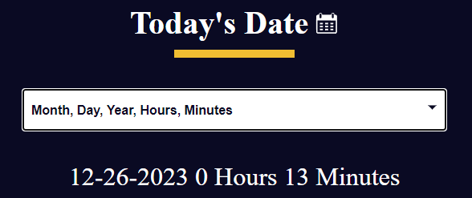

  

  
  
  

# FreeCodeCamp - Learn the Date Object by Building a Date Formatter
Working with dates in JavaScript can be challenging. You have to navigate various methods, formats, and time zones. In this project, you'll learn how to work with the JavaScript Date object, including its methods and properties. You'll also learn how to correctly format dates.

This project will cover concepts such as the getDate(), getMonth(), and getFullYear() methods.

  <table>
    <tr>
      <td align="center">
        <strong>
Select screen
</strong>
        
      </td>
    </tr>
    <tr>
      <td align="center">
        <strong>
Formatted date
</strong>
        
      </td>
    </tr>
  </table>

